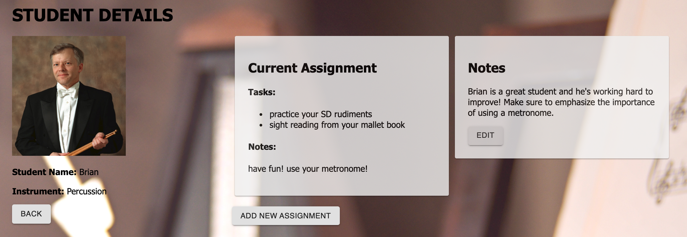
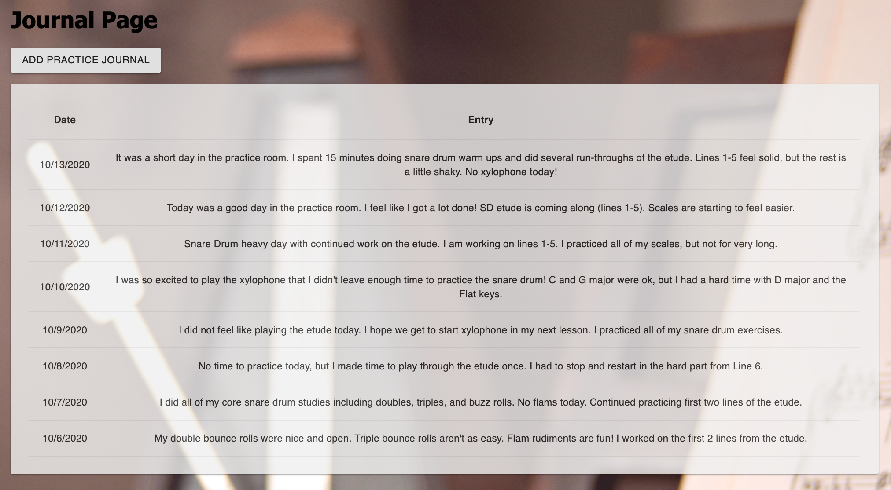
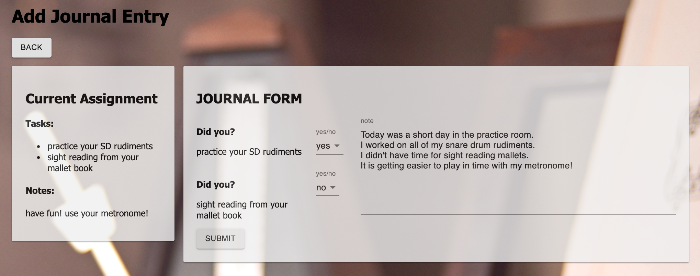
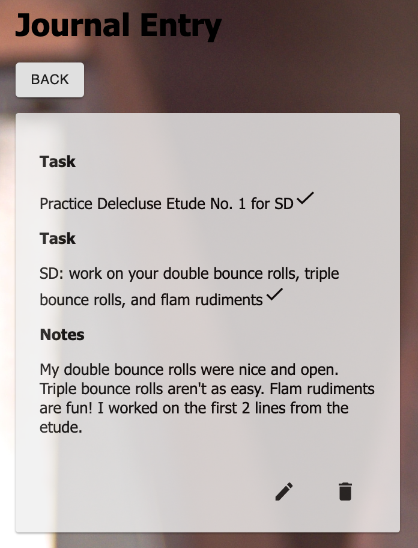

# My Studio Web Application

## Description

_Duration: 2 Week Sprint (WIP)_

My Studio is a web application that aims to help simplify studio management for teachers and spark joy in the practice process for students.

A teacher user manages their studio of private students and can add a new student. The new student is sent an automated email (using Nodemailer) to register their account. Additional functionality includes adding an assignment and keeping notes to track a student's progress.

A student user views their current assignment and can post entries to their practice journal.

[My Studio](https://my-studio.herokuapp.com/#/home)

## Screenshots

## Prerequisites

Before you get started, make sure you have the following software installed on your computer:

- [Node.js](https://nodejs.org/en/)
- [PostrgeSQL](https://www.postgresql.org/)
- [Nodemon](https://nodemon.io/)

## Installation

1. Create a new database called `my_studio`
2. The queries in the `database.sql` file are set up to create all the necessary tables and populate the needed data to allow the application to run correctly. The project is built on [Postgres](https://www.postgresql.org/download/), so you will need to make sure to have that installed. I recommend using Postico to run those queries as that was used to create the queries
3. Open up your editor of choice and run an `npm install`
4. Run `npm run server` in your terminal
5. Run `npm run client` in a second terminal
6. The `npm run client` command will open up a new browser tab for you!

## Usage

### Teacher

1. You must register as a teacher. Teachers have the ability to invite students to sign up.
2. Once a teacher is signed in, they will see a list of their students. A teacher can add a student by clicking the `ADD STUDENT` button.
3. A teacher can click on a student to see more information about that student.
4. When viewing an individual student, a teacher can add a new assignment to that student by clicking the `ADD NEW ASSIGNMENT` button.
5. A teacher can edit the Notes field by clicking the `EDIT` button.

### Student

1. A student will receive an email inviting them to complete registration for the app.
2. Once a student is logged in, they will see their current assignment.
3. To access the practice journal a student will click the `Journal` link in the Nav Bar.
4. A student can review a previous journal entry by clicking on the entry item in the table.
5. A student can add a new journal entry by clicking the `ADD PRACTICE JOURNAL` button and completing the form.

## Built With

- JavaScript
- React
- Redux
- Redux-Saga
- Axios
- Node.js
- Express
- PostgreSQL
- Material-UI
- SweetAlert
- Luxon
- Nodemailer
- Heroku

## Acknowledgements

Thanks to [Prime Digital Academy](www.primeacademy.io) who equipped and helped me to make this application a reality!

## Support

If you have any suggestions or issues, please email me: mymusicstudiodev@gmail.com
